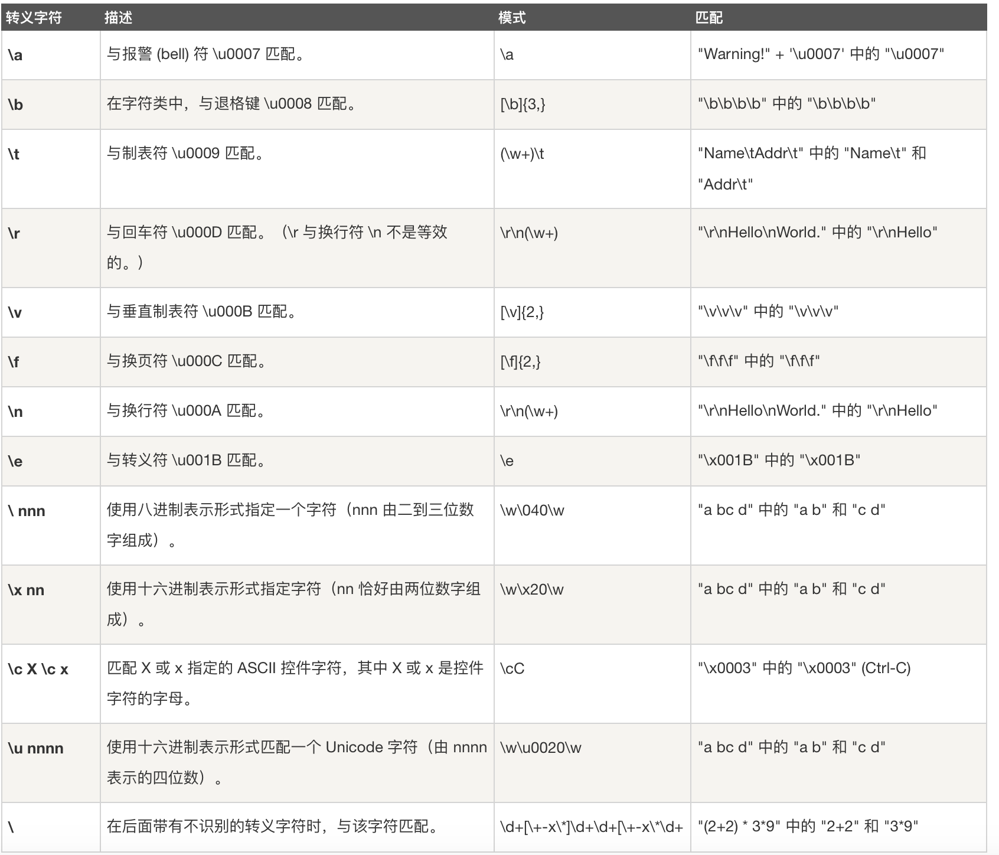
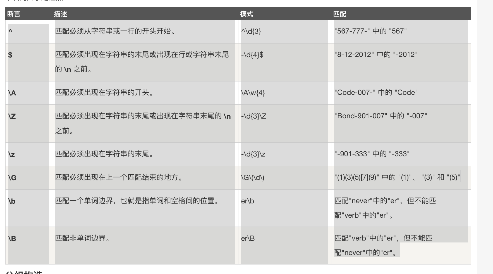
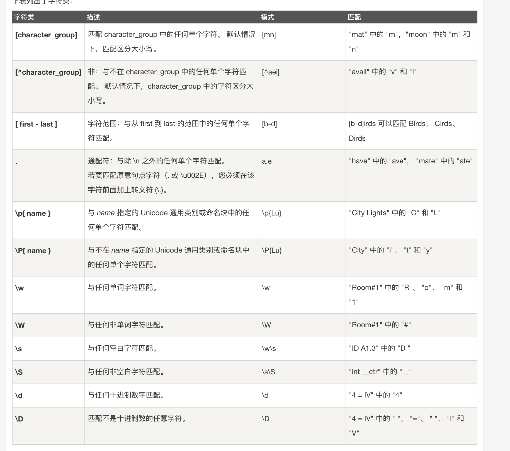
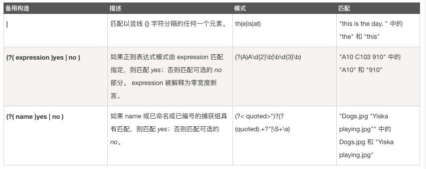
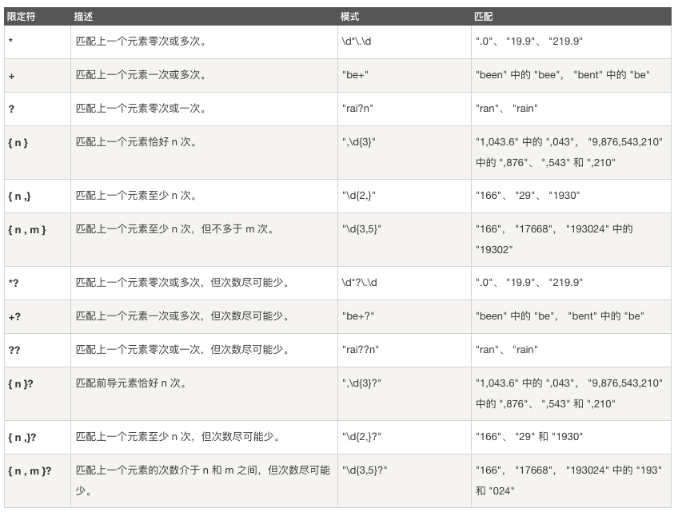

# 
字符串处理</string>

## 2.正则表达式

* 检索
* 匹配

* 主要实现功能：
    验证， 提取，分割，替换

[] 内是需要匹配的字符

{} 内是指定匹配字符的数量

（）是用来分组的 或者标示优先级

^ 标示正则式的开启 非

$ 标示正则式的结束

* 转义字符

* 定位元字符

* 基本语法元字符

* 备用构造

z|food  a  food    
(z|f)ood  zood food 

* 重复描述字符(限定符号)

* 择一匹配

* 对正则表达式分组

* 常用正则表达式

* 查找&替换功能

## 3.Regex类

* 方法（基本所有的方法都有一个静态方法和一个对应的实例方法）这里主要介绍实例方法
    1. bool IsMatch(string input): 判断输入字符串能否找到匹配项目
    2. Match()  : 提取一个符合要求的匹配
    3. Matchs()  : 提取所有匹配
    4. Replace();  替换

## 4 贪婪模式&非贪婪模式

## 5 正则替换

## 6 单词边界（必须是字母才行）

## 7 反向引用

 

