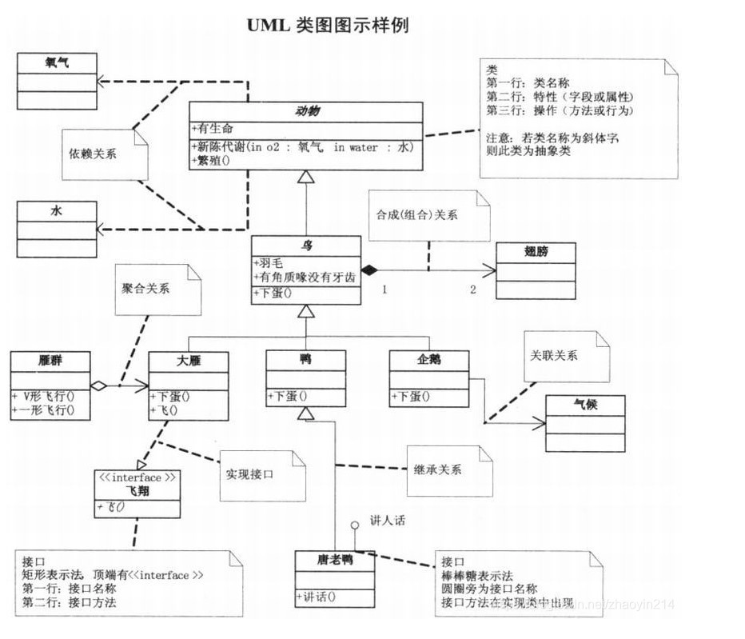
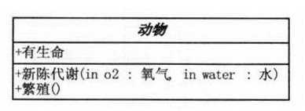
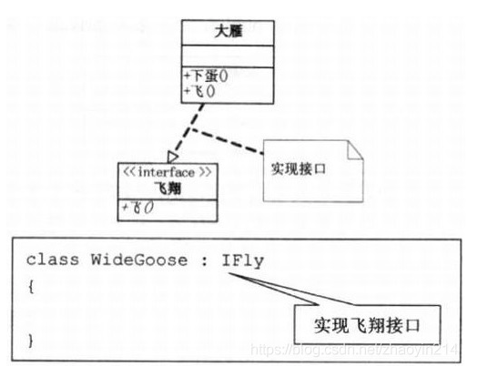
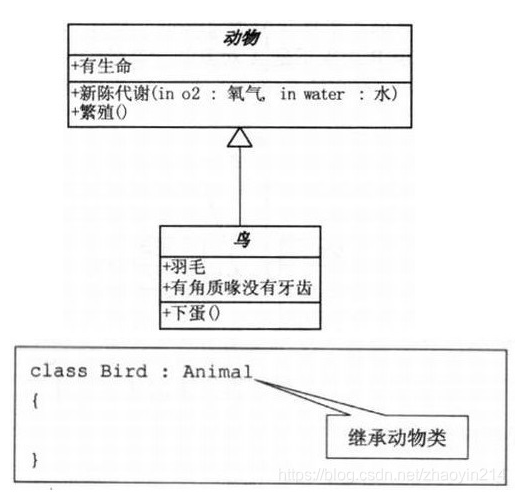
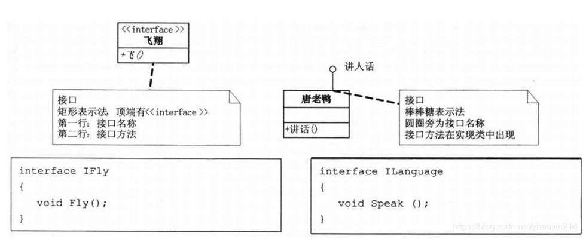
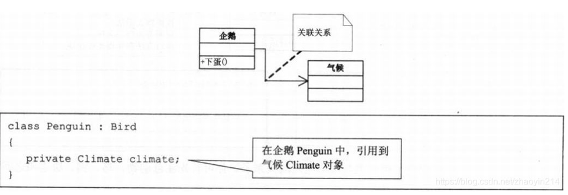
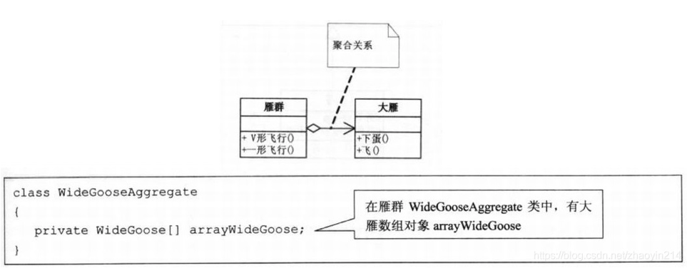
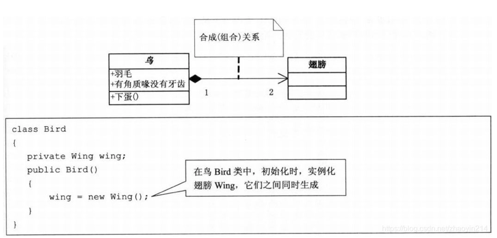
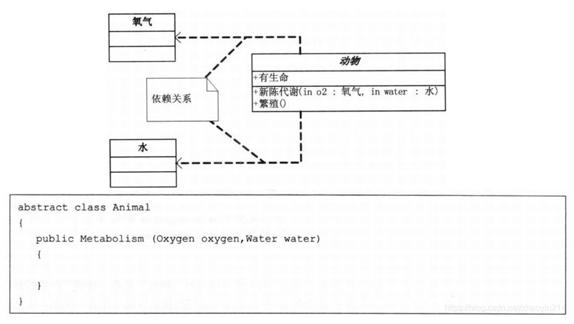
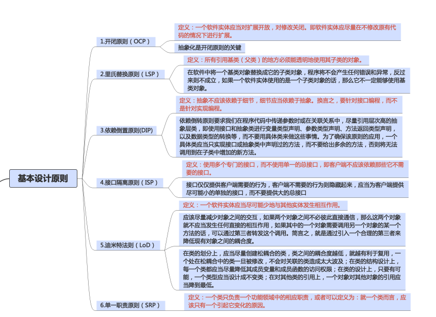

# <font color=blue><center>设计模式总结&程序设计概要</center></font>

## 一，概要
* 学习设计模式了解设计原则的目的
    1. 规范代码结构：
        `为了提高代码可读性，出现问题时能够更好的定位问题。需要合理的代码结构`
    2. 约束修改，降低测试成本：
        `防止在解决出现的问题时引入新的问题，降低对现有已验证逻辑的修改，避免回归测试｜降低回归测试次数`
    3. 方便扩展功能，减少新功能&旧功能的交互
        `因为新旧功能大概率不是一个人写的，如果存在大量交互，会需要大量时间去理解老的代码逻辑，降低新老功能之间的交互`
    
* 类关系的基本分类&UML类图：


* `类图`:用矩形框表示，类图分三层，第一层是类名，如果是抽象类，则用斜体显示；第二层是类的特性，通常是字段和属性；第三层是类的操作，通常是方法或行为。前置符号：+表示public；-表示private；#表示protected。
<br></br>

* `接口图`:例如：飞翔）：接口（interface）用矩形框表示，接口图分两层，第一层是接口名，顶端有<<interface>>；第二层是接口方法。接口还可以使用棒棒糖表示法表示。
<br></br>

* `继承`：用空心三角形 + 实线表示
<br></br>

* `实现`：用空心三角形 + 虚线表示；
<br></br>

* `关联`: 一个类“知道”另一个类（如引用另一个类对象作为成员），用实线箭头表示
<br></br>

*  `聚合`: 表示一种弱的“拥有”关系，A对象可以包含B对象，但B对象不是A对象的一部分，用空心菱形 + 实线箭头表示；
<br></br>

* `合成/组合`: 是一种强的“拥有”关系，体现严格的部分和整体的关系，部分和整体的生命周期相同，用实心菱形 + 实线箭头表示；合成关系连线两端的数字称为基数，表示这一端的类可以有几个实例，如果一个类可能有无数个实例，则用“n”表示。关联关系、聚合关系也可以有基数。
<br></br>

* `依赖关系`: 用虚线箭头来表示；
<br></br>

* 推荐UML工具
    1. StarUML
    2. PlantUML

## 二， 基本设计原则



### 1. 开闭原则(OCP)

>定义： 一个软件应当对扩展开放，对修改封闭。 即当软件需要变化时，尽量通过扩展软件实体的行为来实现变化，而不是通过修改已有的代码来实现变化。

* 基本介绍：
    1. 一个软件实体如类，模块和函数应该对扩展开放（对于提供方来说），对修改关闭（对于使用方来说）。用抽象构建框架，用实现扩展细节。
    2. 当软件需要变化时，尽量通过扩展软件实体的行为来实现变化，而不是通过修改已有的代码来实现变化。
    3. 编程中遵循其它原则，以及使用设计模式的目的就是遵循开闭原则。

* 为什么采用开闭原则
    1. 考虑对测试的影响，采用开闭原则，那么进行了扩展不会影响原有的逻辑，在测试的时候只测试新增的代码即可，不用回归之前的，否则要将整个系统代码进行回归测试，极大地增加了测试成本。
    2. 开闭原则可以提高复用性：只有所有的逻辑都是原子逻辑组合来的，粒度才会更小，那么被复用的可能性才会更大。被复用，提高了开发效率，减少了代码量，修改的话只修改抽象出来的原子逻辑即可，不需要每个使用的地方都进行修改
    3. 提高维护性：维护人员只需要扩展类即可，而不需要修改类，减少了对原有代码完全得理解，提高维护效率。

* 如何使用开闭原则
    1. 抽象约束
        * 通过接口和抽象类约束扩展，对扩展进行边界限定，不允许出现在接口或抽象类中不存在的public方法
        * 参数类型、应用对象尽量使用接口或者抽象类，而不是实现类
        * 抽象层尽量保持稳定，一旦确定尽量不要修改，可以使用接口或者抽象类继承的方式，来进行扩展
    2. 元数据(metadata)控制模块行为
        * 什么是元数据，元数据就是描述环境和数据的数据，简单的说就是配置参数，配置参数可以从缓存、数据库、配置文件中读取。
    3. 指定开发章程
        * 在项目整个过程中，每个人都必须遵守的，章程要优先于约束，比如规定spring bean都是用注解，而不是使用配置文件
    4. 封装变化
        * 封装变化包含两层含义：
            1. 将相同的变化封装到一个接口或者抽象类中。
            2. 将不同的变化封装到不同的接口或者抽象类中。

### 2.里氏替换原则(LSP)

> 定义：子类对象（object ofsubtype/derived class）能够替换程序（program）中父类对象（object of base/parent class）出现的任何地方，并且保证原来程序的逻辑行为（behavior）不变及正确性不被破坏。

* 里氏替换原则包含的含义
    1. 子类可以实现父类的抽象方法，但是不能覆盖父类的非抽象方法

    在我们做系统设计时，经常会设计接口或抽象类，然后由子类来实现抽象方法，这里使用的其实就是里氏替换原则。子类可以实现父类的抽象方法很好理解，事实上，子类也必须完全实现父类的抽象方法，哪怕写一个空方法，否则会编译报错。

    里氏替换原则的关键点在于不能覆盖父类的非抽象方法。父类中凡是已经实现好的方法，实际上是在设定一系列的规范和契约，虽然它不强制要求所有的子类必须遵从这些规范，但是如果子类对这些非抽象方法任意修改，就会对整个继承体系造成破坏。而里氏替换原则就是表达了这一层含义。

    2. 子类中可以增加自己特有的方法

    在继承父类属性和方法的同时，每个子类也都可以有自己的个性，在父类的基础上扩展自己的功能。前面其实已经提到，当功能扩展时，子类尽量不要重写父类的方法，而是另写一个方法

    3. 当子类覆盖或实现父类的方法时，方法的前置条件（即方法的形参）要比父类方法的输入参数更宽松

### 3.依赖倒置原则(DIP)
> 定义：高层模块不应该依赖低层模块--两者都应该依赖其抽象 抽象不应该依赖细节--细节应该依赖抽象

* 深入理解

>依赖倒置原则的本质就是通过抽象(抽象类或接口)使各个类或模块实现彼此独立，不互相影响，实现模块间的松耦合。在项目中使用这个规则需要以下原则;
1. 每个类尽量都要有接口或抽象类，或者抽象类和接口都有： 依赖倒置原则的基本要求，有抽象才能依赖倒置
2. 变量的表面类型尽量是接口或者抽象类
3. 任何类都不应该从具体类派生
4. 尽量不要重写基类已经写好的方法(里式替换原则)
5. 结合里式替换原则来使用： 结合里式替换原则和依赖倒置原则我们可以得出一个通俗的规则，接口负责定义public属性和方法，并且声明与其他对象的依赖关系，抽象类负责公共构造部分的实现，实现类准确的实现业务逻辑，同时在适当的时候对父类进行细化。

### 4.接口隔离原则(ISP)
> 定义：客户端不应该依赖它不需要的接口；一个类对另一个类的依赖应该建立在最小的接口上。

* 接口隔离是对接口进行约束，其包含以下4层含义：
    1. 接口要尽量小：根据接口隔离原则拆分接口时，首先必须满足单一职责原则
    2. 接口要高内聚：高内聚 就是提高接口、类、模块的处理能力，减少对外的交互。--具体为：接口中尽量减少public方法，接口是对外的承诺，承诺越少越有利，变更的风险也就越少，同时也有利于降低成本。
    3. 定制服务
    4. 接口设计是有限度的。
### 5.迪米特法则(LoD)
>定义：一个对象应该对其它对象保持最少的了解。类与类之间的关系越密切，耦合度越大，当一个类发生改变时，对另一个类的影响也越大。

* 尽量降低类与类之间的耦合
    1. 对于被依赖的类来说，无论逻辑多么复杂，都尽量地的将逻辑封装在类的内部，对外除了提供的public方法，不对外泄漏任何信息。
    2. 迪米特法则还有一个更简单的定义：只与直接的朋友通信。首先来解释一下什么是直接的朋友：每个对象都会与其他对象有耦合关系，只要两个对象之间有耦合关系，我们就说这两个对象之间是朋友关系。耦合的方式很多，依赖、关联、组合、聚合等。其中，我们称出现成员变量、方法参数、方法返回值中的类为直接的朋友，而出现在局部变量中的类则不是直接的朋友。也就是说，陌生的类最好不要作为局部变量的形式出现在类的内部。


### 6.单一职责原则(SRP)
>定义：不存在多余一个导致类变更的原因。即一个类只负责一项职责。

 * 优点：
    1. 降低类的复杂度，一个类只负责一项职责
    2. 提高类的可读性，可维护性
    3. 降低变更带来的风险   


## 三，设计模式

### 1. 创建型设计模式

#### 单例模式：

#### 建造模式：

#### 原型模式：

#### 工厂模式（简单，普通，抽象）

### 2. 行为型设计模式

#### 策略模式：

#### 状态模式：

#### 责任链模式：

#### 解释器模式：

#### 命令模式：

#### 观察者模式：

#### 备忘录模式：

#### 迭代器模式：

#### 模版方法模式：

#### 访问者模式：

#### 中介者模式：

### 3. 结构型设计模式

#### 装饰模式：

#### 代理模式：

#### 组合模式：

#### 桥接模式：

#### 适配器模式：

#### 享元模式：

#### 外观模式：

## 1. 工厂模式

## 2. 组合模式

## 3. 代理模式

## 4. 装饰器模式

## 5. 职责链模式

## 6. 单例模式

## 7. 适配器模式

* 定义：把一个类的接口变换成客户端所期待的另一种接口，从而使得原本接口不匹配无法一起工作的两个类能够一起工作。

* 分类：
    1. 类适配器模式
    2. 对象适配器模式

* 使用场景
    1. 系统需要复用现有的类，而该类的接口不符合系统的需求。
    2. 想要建立一个可重复使用的类，用于一些彼此之间没有太大关联的类，包括一些可能在将来引进的类一起工作。
    3. 对象适配器模式，在设计里需要该比那多个已经有的子类的接口。使用类的适配器模式，需要针对每一个子类做适配器。

* 代码示例
```csharp

```

## 8. 桥接模式

* 结构型设计模式

* 定义：将抽象部分与实现部分脱耦，使他们可以独立变化（链接了2个维度的东西，而且两个维度又都有强烈的变化).将一个事物中多个维度变化分离。

* 结构：
    1. Abstraction : 定义抽象类的接口，维护一个只想Implementor类型对象的指针。
    2. RefinedAbstraction : 扩充由Abstranction定义的接口。
    3. Implementor : 定义实现类的接口（Implementor接口提供基本操作，Abstraction定义基于基本操作的较高层次操作）
    4. ConcreteImplementorA/B : 实现Implementor接口并定义它的具体实现。

* 理解
    1. 分离抽象&行为

* 代码示例

```csharp
```

## 9. 备忘录模式

* 定义： 在不破坏封装性的前提下，捕获一个对象的内部状态，并在该对象之外保存这个状态。这样以后就可以将该对象恢复到原先保存的状态。

* 结构：
    1. Memento:  为创建对象的各个部件指定抽象接口。
    2. Originator: 创建一个备忘录，记录当前时刻的内部状态。 使用备忘录恢复内部状态。
    3. Caretaker: 负责保存备忘录。 不能对备忘录的内容进行操作或者检查。

* 在备忘录模式中`Caretaker`负责把`Originator`创建的`Memento`进行备份，当需要的时候，`Originator`可以再使用`Caretaker`中保存的`Memento`进行恢复。`Originator`中的所有状态呗恢复到备份操作之前的状态。


* 示例代码
```csharp
namespace D_DesignPattern
{
    public class MementoPattern
    {
        public static void DoMain()
        {
            
            Originator o =new Originator();

            o.State = "On";
            
            Caretaker c = new Caretaker();
            c.Memento = o.CreateMemento();

            o.State = "Off";
            
            o.SetMemento(c.Memento);


        }
    }
    
    #region 备忘录模式
    public class Memento
    {
        private string _state;

        public Memento(string state)
        {
            _state = state;
        }

        public string State => _state;
    }

    public class Originator
    {
        private string _state;

        public string State
        {
            get => _state;
            set
            {
                _state = value;
                Console.WriteLine("State = " + _state);
            }
        }

        public Memento CreateMemento()
        {
            return new Memento(_state);
        }

        public void SetMemento(Memento memento)
        {
            Console.WriteLine("Restoring state...");
            State = memento.State;
        }
    }

    public class Caretaker
    {
        private Memento _memento;
        
        public Memento Memento
        {
            get => _memento;
            set => _memento = value;
        }
    }
    #endregion 
}
```

* 适用情形：
    1. 必须保存一个对象在某一个时刻的部分状态，这样以后需要时才能恢复到先前的状态。
    2. 适用于由原发器管理，却又必须存储在原发器之外的信息。
    3. 需要考虑对象状态的效率问题，如果对象开销比较大，采用某种增量模式来改进Memento模式。


## 10. 命令模式

* 定义：命令模式的目的是接触命令发出者和接受者之间的紧密耦合关系，使二者相对独立，有利于程序的并行开发和代码的维护。命令模式的核心思想是将请求封装为一个对象，将其作为命令发起者和接受者的中介，二抽象出来的命令对像又使得能够对一系列请求进行操作，如对请求进行排队，记录请求日志以及支持可撤销的操作等。

* 类型： 行为行模式

* 结构：
    1. Command: 命令抽象类，声明一个执行操作的接口Execute,该抽象类不实现这个接口，所有的具体命令都继承自命令抽象类。
    2. ConcreteCommand: 定义一个接受者对象对象&动作之间的绑定 //  调用Receiver的操作，实现Execute方法。
    3. Invoker: 命令的接受者，将命令请求传递给相应的命令对象，每个ConcreteCommand都是一个Invoker的成员。
    4. Receiver: 命令的接受者，知道如何实施&执行一个请求相关的操作
    5. Client: 客户单程序，创建一个具体的命令对象并设定它的接受者。
* 注意：
> `Command`对象作为`Invoker`的一个属性，当点击事件发生时，Invoker调用方法`Invoke()`将请求发送给`ConcreteComand`,再由`ConcreteCommand`调用`Execute()`将请求发送给`Receiver`,`Client`负责创建所有的角色，并设定`Command`与`Invoker`和`Receiverd`之间的绑定方式。

* 示例代码
```csharp
namespace D_DesignPattern
{
    public class CommandExam
    {
        public static void DoMain()
        {
            Receiver r =new Receiver();
            Command c = new ConcreteCommandA(r);
            Invoke i = new Invoke(c);
            
            i.ExecuteCommand();
        }
    }

    #region 命令模式
    public abstract class Command
    {
        protected Receiver _receiver;

        public Command(Receiver receiver)
        {
            _receiver = receiver;
        }

        public abstract void Action();
    }


    public class ConcreteCommandA : Command
    {
        public ConcreteCommandA(Receiver receiver) : base(receiver)
        {
        }

        public override void Action()
        {
            _receiver.Run1000Meters();
        }
    }

    public class Invoke
    {
        public Command _command;

        public Invoke(Command command)
        {
            _command = command;
        }

        public void ExecuteCommand()
        {
            _command.Action();
        }
    }

    public class Receiver
    {
        public void Run1000Meters()
        {
            Console.WriteLine("跑100m");
        }
    }

    #endregion 
}
```

* 优点：
    1. 命令模式使得新的命令很容易被加入到系统中
    2. 可以设计一个命令队列来实现对请求的`Undo`和`Redo`操作。
    3. 可以较容易的将命令写入日志。
    4. 可以把命令聚合在一起，合成为合成命令。合成命令合成模式的应用。

## 11. 享元模式

* 定义：运用共享技术有效地支持大量细粒度的对象。享元模式可以避免大量相似类的开销，在软件开发过程中如果需要生成大量细粒度的类实例来表示数据，如果这些实例除了几个参数外基本上都是相同的，这时候就可以使用享元模式来大幅度减少需要实例化类的数量。如果能把这些参数（指的是这些类实例不同的参数）移到实例类外面，在方法调用时将他们传递进来，这样就可以通过共享大幅度减少单个实例的数目（这也是享元模式实现的要领），然而我们把类实例外面的参数称为享元对象的外部状态，把在享元对象内部状态与外部状态的定义为：

    1. 内部状态：在享元对象的内部并且不会随着环境改变而改变的共享部分

    2. 外部状态：随着环境改变而改变，不可以共享的状态。

* 代码示例：
```csharp
namespace D_DesignPattern
{
    public class FlyweightExam
    {
        
    }
    
    # region 享元模式

    public abstract class Flyweight
    {
        public abstract void Operation(int extrinsicstate);
    }


    public class FlyweightFactory
    {
        public Dictionary<string , Flyweight> _dictFlyweights = new Dictionary<string, Flyweight>();

        public FlyweightFactory()
        {
            _dictFlyweights.Add("A" , new ConcreteFlyweight("A"));
            _dictFlyweights.Add("B" ,  new ConcreteFlyweight("B"));
            _dictFlyweights.Add("C" , new ConcreteFlyweight("C"));
        }

        public Flyweight GetFlyweight(string key)
        {
            Flyweight temp;
            if (!_dictFlyweights.TryGetValue(key, out temp))
            {
                Console.WriteLine("驻留池中不存在字符串" + key);
                return null;
            }
            return temp;
        }
    }

    public class ConcreteFlyweight : Flyweight
    {
        public string _instrinsicstate;

        public ConcreteFlyweight(string innerstate)
        {
            _instrinsicstate = innerstate;
        }

        public override void Operation(int extrinsicstate)
        {
            Console.WriteLine($"具体的实现类： intrinsicstate: {_instrinsicstate}, extrinsicstate; {extrinsicstate}");
        }
    }
    # endregion 
}
```
* 在下面所有条件都满足时，可以考虑使用享元模式：

    1. 一个系统中有大量的对象；
    2. 这些对象耗费大量的内存；
    3. 这些对象中的状态大部分都可以被外部化
    4. 这些对象可以按照内部状态分成很多的组，当把外部对象从对象中剔除时，每一个组都可以仅用一个对象代替
    5. 软件系统不依赖这些对象的身份，

* 注意：
    满足上面的条件的系统可以使用享元模式。但是使用享元模式需要额外维护一个记录子系统记录已有的所有享元的表，而这也需要耗费资源，所以，应当在有足够多的享元实例可共享时才值得使用享元模式。

* 总结：
    享元模式主要是用来解决由于大量的细粒度对象所造成的内存开销问题，它在实际开发中并不常用，可以作为底层的提升性能的一种手段。

## 12.中介者模式

* 定义：中介者模式，定义了一个中介对象来封装一系列对象之间的交互关系。中介者使各个对象之间不需要显式地相互引用，从而是耦合性降低，而且可以独立改变它们之间的交互行为。

* 代码示例：

```csharp
namespace D_DesignPattern
{
    public class MediatorExam
    {
        public static void DoMain()
        {
            AbstractCardPartner A = new PartnerA();
            AbstractCardPartner B = new PartnerB();

            A.MoneyCount = 20;
            B.MoneyCount = 20;
            AbstractMediator mediator = new MediatorPartner(A,B);
            
            A.ChangeCount(5,mediator);

            Console.WriteLine($"A 现在的钱是：{A.MoneyCount}");
            Console.WriteLine($"B 现在的钱是: {B.MoneyCount}");

            Console.WriteLine("=====================");
            
            B.ChangeCount(10,mediator);
            Console.WriteLine($"A 现在的钱是：{A.MoneyCount}");
            Console.WriteLine($"B 现在的钱是: {B.MoneyCount}");
        }
    }

    # region 中介者模式

    public abstract class AbstractCardPartner
    {
        public int MoneyCount { get; set; }

        public AbstractCardPartner()
        {
            MoneyCount = 0;
        }

        public abstract void ChangeCount(int count, AbstractMediator mediator);
    }

    public class PartnerA : AbstractCardPartner
    {
        public override void ChangeCount(int count, AbstractMediator mediator)
        {
            mediator.AWin(count);
        }
    }

    public class PartnerB : AbstractCardPartner
    {
        public override void ChangeCount(int count, AbstractMediator mediator)
        {
            mediator.BWin(count);
        }
    }

    public abstract class AbstractMediator
    {
        protected AbstractCardPartner A;
        protected AbstractCardPartner B;

        public AbstractMediator(AbstractCardPartner a, AbstractCardPartner b)
        {
            A = a;
            B = b;
        }

        public abstract void AWin(int count);
        public abstract void BWin(int count);
    }

    public class MediatorPartner : AbstractMediator
    {
        public MediatorPartner(AbstractCardPartner a, AbstractCardPartner b) : base(a, b)
        {
        }

        public override void AWin(int count)
        {
            A.MoneyCount += count;
            B.MoneyCount -= count;
        }

        public override void BWin(int count)
        {
            A.MoneyCount -= count;
            B.MoneyCount += count;
        }
    }
    # endregion
}
```

* 总结
> 中介者模式，定义了一个中介对象来封装系列对象之间的交互。中介者使各个对象不需要显式地相互引用，从而使其耦合性降低，而且可以独立地改变它们之间的交互。中介者模式一般应用于一组定义良好的对象之间需要进行通信的场合以及想定制一个分布在多个类中的行为，而又不想生成太多的子类的情形下。

> 新增加一个相同类时，不得不去修改抽象中介者类和具体中介者类，此时可以使用观察者模式和状态模式来解决这个问题。

## 13. 观察者模式

* 定义：观察者模式定义了一种一对多的依赖关系，让多个观察者对象同时监听一个主题对象，这个主题对象在状态发生改变时，会通知所有观察者对象，使它们能够自动更新自己的行为。

* 角色分类
    1. Subject: 抽象主题角色，把所有观察者对象的引用保存在一个列表中，并提供增加和删除观察者对象的操作，（抽象类/接口）
    2. Observer: 抽象观察者角色， 为所有具体观察者定义接口，在得到主题通知时更新自己（抽象类/接口）
    3. ConcreteSubject: 具体主题角色，实现抽象主题
    4. ConcreteObserver: 实现抽象观察者角色所要求的接口。

* 代码示例1
```csharp
 #region 观察者模式示例1：


    //订阅号抽象类
    public abstract class Game
    {
        private List<IObserver> observers = new List<IObserver>();

        public string Symbol { get; set; }
        public string Info { get; set; }

        public Game(string symbol, string info)
        {
            Symbol = symbol;
            Info = info;
        }

        # region 新增对订阅号列表的维护操作

        public void AddObserver(IObserver ob)
        {
            observers.Add(ob);
        }

        public void RemoveObserver(IObserver ob)
        {
            observers.Remove(ob);
        }

        #endregion

        public void Update()
        {
            observers.ForEach(_ => _.ReceiveAndPrint(this));
        }
    }

    // 订阅者接口
    public interface IObserver
    {
        void ReceiveAndPrint(Game game);
    }


    public class TenGame : Game
    {
        public TenGame(string symbol, string info) : base(symbol, info)
        {
        }
    }

    //订阅者类
    public class Subscriber : IObserver
    {
        public string Name { get; set; }

        public Subscriber(string name)
        {
            Name = name;
        }

        public void ReceiveAndPrint(Game game)
        {
            Console.WriteLine($"Notified {Name} of {game.Symbol}'s Info is {game.Info} ");
        }
    }
    #endregion
```
* 代码示例2 
```csharp
    # region csharp 中使用事件&委托简化观察者模式

    // 委托充当订阅者接口类
    public delegate void NotifyEventHandler(object sender);


    // 抽象订阅号类
    public class Game2
    {
        public NotifyEventHandler NotifyEvent;

        public string Symbol { get; set; }
        public string Info { get; set; }

        public Game2(string symbol, string info)
        {
            Symbol = symbol;
            Info = info;
        }

        # region 对订阅号列表的维护

        public void AddObserver(NotifyEventHandler ob)
        {
            NotifyEvent += ob;
        }

        public void RemoveObserver(NotifyEventHandler ob)
        {
            NotifyEvent -= ob;
        }

        # endregion

        public void Update()
        {
            NotifyEvent?.Invoke(this);
        }
    }

    //具体订阅号
    public class TenGame2 : Game2
    {
        public TenGame2(string symbol, string info) : base(symbol, info)
        {
            
        }
    }

    //具体订阅者类
    public class Subscriber2
    {
        public string Name { get; set; }

        public Subscriber2(string name)
        {
            this.Name = name;
        }

        public void ReceiveAndPrint(object obj)
        {
            var game = obj as TenGame2;
            if (game != null)
            {
                Console.WriteLine($"Notified {Name} of {game.Symbol}'s info is {game.Info}");
            }
        }
    }
    # endregion
```

* 总结：
>到这里，观察者模式的分享就介绍了。观察者模式定义了一种一对多的依赖关系，让多个观察者对象可以同时监听某一个主题对象，这个主题对象在发生状态变化时，会通知所有观察者对象，使它们能够自动更新自己，解决的是“当一个对象的改变需要同时改变多个其他对象”的问题

## 14.状态模式

* 定义：
    1. 状态模式将每种状态对应的行为抽象出来成为单独新的对象，这样状态的变化不再依赖于对象内部的行为。
    2. 状态模式——允许一个对象在其内部状态改变时自动改变其行为，对象看起来就像是改变了它的类。
* 示例代码：

```csharp
    # region 状态模式

    //抽象状态类
    public abstract class State
    {
        public Account Account { get; set; }
        public double Balance { get; set; }
        public double Interest { get; set; }
        public double LowerLimit { get; set; } //下限
        public double UpperLimit { get; set; }

        public abstract void Deposit(double amount);
        public abstract void Withdraw(double amount);
        public abstract void PayInterest(); //获取利息
    }


    //透支状态
    public class RedState : State
    {
        public RedState(State state)
        {
            Balance = state.Balance;
            Account = state.Account;
            Interest = 0.00;
            LowerLimit = -100.00;
            UpperLimit = 0.00;
        }

        public override void Deposit(double amount)
        {
            Balance += amount;
        }

        public override void Withdraw(double amount)
        {
            throw new System.NotImplementedException();
        }

        public override void PayInterest()
        {
            throw new System.NotImplementedException();
        }

        private void StateChangeCheck()
        {
            if (Balance > UpperLimit)
            {
                Account.State = new SilverState(this);
            }
        }
    }


    //标准账户
    public class SilverState : State
    {
        public SilverState(State state) : this(state.Balance, state.Account)
        {
        }

        public SilverState(double balance, Account account)
        {
            Balance = balance;
            Account = account;
            Interest = 0.00;
            LowerLimit = 0.00;
            UpperLimit = 1000.00;
        }


        public override void Deposit(double amount)
        {
            Balance += amount;
            StateChangeCheck();
        }

        public override void Withdraw(double amount)
        {
            Balance -= amount;
            StateChangeCheck();
        }

        public override void PayInterest()
        {
            Balance += Interest * Balance;
            StateChangeCheck();
        }

        private void StateChangeCheck()
        {
            if (Balance < LowerLimit)
            {
                Account.State = new RedState(this);
            }
            else if (Balance > UpperLimit)
            {
                Account.State = new GoldState(this);
            }
        }
    }


    public class GoldState : State
    {
        public GoldState(State state)
        {
            Balance = state.Balance;
            Account = state.Account;
            Interest = 0.05;
            LowerLimit = 1000.00;
            UpperLimit = 10000000.00;
        }

        public override void Deposit(double amount)
        {
            Balance += amount;
            StateChangeCheck();
        }

        public override void Withdraw(double amount)
        {
            Balance -= amount;
            StateChangeCheck();
        }

        public override void PayInterest()
        {
            Balance += Interest * Balance;
            StateChangeCheck();
        }

        private void StateChangeCheck()
        {
            if (Balance < 0.0)
            {
                Account.State = new RedState(this);
            }
            else if (Balance < LowerLimit)
            {
                Account.State = new SilverState(this);
            }
        }
    }


    public class Account
    {
        public State State { get; set; }
        public string Owner { get; set; }

        public Account(string owner)
        {
            Owner = owner;
            State = new SilverState(0.0, this);
        }

        public double Balance
        {
            get => State.Balance;
        }

        public void Deposit(double amount)
        {
            State.Deposit(amount);
            Console.WriteLine($"存款金额为 {amount:C}");
            Console.WriteLine($"账户余额为 {Balance:C}");
            Console.WriteLine($"账户状态为 {State.GetType().Name}");
            Console.WriteLine();
        }

        public void WithDraw(double amount)
        {
            State.Withdraw(amount);
            Console.WriteLine($"取款金额为 {amount:C}");
            Console.WriteLine($"账户余额为 {Balance:C}");
            Console.WriteLine($"账户状态为 {State.GetType().Name}");
        }

        public void PayInterest()
        {
            State.PayInterest();
            Console.WriteLine("Interest Paid --- ");
            Console.WriteLine("账户余额为 =:{0:C}", this.Balance);
            Console.WriteLine("账户状态为: {0}", this.State.GetType().Name);
            Console.WriteLine();
        }
    }

    # endregion
```

## 15 策略模式

* 定义：
    1. 策略模式是针对一组算法，将每个算法封装到具有公共接口的独立的类中，从而使它们可以相互替换。策略模式使得算法可以在不影响到客户端的情况下发生变化。
    2. 策略模式是对算法的包装，是把使用算法的责任和算法本身分割开，委派给不同的对象负责。策略模式通常把一系列的算法包装到一系列的策略类里面。用一句话慨括策略模式就是——“将每个算法封装到不同的策略类中，使得它们可以互换”。

* 成员结构：
    1. Context: 环境角色，持有一个Strategy类的引用。
    2. Strategy: 抽象策略角色，给出所有具体策略类所需要实现的接口。
    3. ConcreteStrategy:具体策略角色，包装了相关算法或行为。

* 示例代码：
```csharp
namespace D_DesignPattern
{
    public class StrategyExam
    {
        public static void DoMain()
        {
            // 个人所得税方式
            InterestOperation operation = new InterestOperation(new PersonalTaxStrategy());
            Console.WriteLine("个人支付的税为：{0}", operation.GetTax(5000.00));

            // 企业所得税
            operation = new InterestOperation(new EnterpriseTaxStrategy());
            Console.WriteLine("企业支付的税为：{0}", operation.GetTax(50000.00));
        }
    }

    #region 策略模式

    public interface ITaxStrategy
    {
        double CalculateTax(double income);
    }

    public class PersonalTaxStrategy : ITaxStrategy
    {
        public double CalculateTax(double income)
        {
            return income * 0.12;
        }
    }

    public class EnterpriseTaxStrategy : ITaxStrategy
    {
        public double CalculateTax(double income)
        {
            return (income - 3500) > 0 ? (income - 3500) * 0.045 : 0.0;
        }
    }

    public class InterestOperation
    {
        private ITaxStrategy _strategy;

        public InterestOperation(ITaxStrategy strategy)
        {
            _strategy = strategy;
        }

        public double GetTax(double income)
        {
            return _strategy.CalculateTax(income);
        }
    }

    #endregion
}
```

* 适用场景：
    1.  一个系统需要动态地在几种算法中选择一种的情况下。那么这些算法可以包装到一个个具体的算法类里面，并为这些具体的算法类提供一个统一的接口。
    2. 如果一个对象有很多的行为，如果不使用合适的模式，这些行为就只好使用多重的if-else语句来实现，此时，可以使用策略模式，把这些行为转移到相应的具体策略类里面，就可以避免使用难以维护的多重条件选择语句，并体现面向对象涉及的概念。


## 16.访问者模式

* 定义：
> 　访问者模式是封装一些施加于某种数据结构之上的操作。一旦这些操作需要修改的话，接受这个操作的数据结构则可以保存不变。访问者模式适用于数据结构相对稳定的系统， 它把数据结构和作用于数据结构之上的操作之间的耦合度降低，使得操作集合可以相对自由地改变。

> 数据结构的每一个节点都可以接受一个访问者的调用，此节点向访问者对象传入节点对象，而访问者对象则反过来执行节点对象的操作。这样的过程叫做“双重分派”。节点调用访问者，将它自己传入，访问者则将某算法针对此节点执行。

* 角色：
    1. Vistor:  声明一个活多个访问操作，使得所有具体访问者必须实现的接口。
    2. ConcreteVistor: 实现抽象访问者角色中所有声明的接口。
    3. Element: 声明一个接受操作，接受一个访问者对象作为参数。
    4. ConcreteElement: 实现抽象元素所规定的接受操作。
    5. ObjectStructure: 节点的容器，可以包含多个不同类或接口的容器。
* 简介：
> 把作用于具体元素的操作由访问者对象来调用

* 代码示例
```csharp
namespace D_DesignPattern
{
    public class VistorExam
    {
        public static void DoMain()
        {
            ObjectStructure objectStructure = new ObjectStructure();

            foreach (Element element in objectStructure.Elements)
            {
                element.Accept(new ConcreteViator());
            }
        }
    }
    
    # region 访问者模式
    
    // 抽象访问者
    public interface IViator
    {
        void Visit(ElementA a);
        void Visit(ElementB b);
    }
    
    // 具体访问者
    public class ConcreteViator:IViator
    {
        public void Visit(ElementA a)
        {
            a.Print();
        }

        public void Visit(ElementB b)
        {
            b.Print();
        }
    }


    public abstract class Element
    {
        public abstract void Print();
        public abstract void Accept(IViator viator);
    }

    public class ElementA : Element
    {
        public override void Print()
        {
            Console.WriteLine("AAAAAAA");
        }

        public override void Accept(IViator viator)
        {
            viator.Visit(this);
        }
    }
    
    public class ElementB : Element
    {
        public override void Print()
        {
            Console.WriteLine("BBBBBBB");
        }

        public override void Accept(IViator viator)
        {
            viator.Visit(this);
        }
    }

    public class ObjectStructure
    {
        private ArrayList elements = new ArrayList();

        public ArrayList Elements => elements;

        public ObjectStructure()
        {
            Random ran = new Random();
            for (int i = 0; i < 6; i++)
            {
                int ranNum = ran.Next(10);
                if (ranNum > 5)
                {
                    elements.Add(new ElementA());
                }
                else
                {
                    elements.Add(new ElementB());
                }
            }
        }
    }
    # endregion 
}
```

* 使用场景：
    1. 如果系统有比较稳定的数据结构，而又有易于变化的算法时，此时可以考虑使用访问者模式。因为访问者模式使得算法操作的添加比较容易。
    2. 如果一组类中，存在着相似的操作，为了避免出现大量重复的代码，可以考虑把重复的操作封装到访问者中。（当然也可以考虑使用抽象类了）
    3. 如果一个对象存在着一些与本身对象不相干，或关系比较弱的操作时，为了避免操作污染这个对象，则可以考虑把这些操作封装到访问者对象中。

* 总结：
> 访问者模式是用来封装一些施加于某种数据结构之上的操作。它使得可以在不改变元素本身的前提下增加作用于这些元素的新操作，访问者模式的目的是把操作从数据结构中分离出来。

## 17.外观模式
* 定义：
外观模式提供了一个统一的接口，用来访问子系统中的一群接口。外观定义了一个高层接口，让子系统更容易使用。使用外观模式时，我们创建了一个统一的类，用来包装子系统中一个或多个复杂的类，客户端可以直接通过外观类来调用内部子系统中方法，从而外观模式让客户和子系统之间避免了紧耦合。


## 18.建造者模式

* 定义：
> 有时需要创建一个复杂对象，并且这个复杂对象由其各部分子对象通过一定的步骤组合而成。

* 代码示例：
```csharp
namespace D_DesignPattern
{
    public class BuilderExam
    {
        public static void DoMain()
        {
            Direct direct = new Direct();
            Builder b1 = new ConcreteBuilder1();
            Builder b2 = new ConcreteBuilder2();
            
            direct.Construct(b1);

            Computer c1 = b1.GetComputer();
            c1.Show();
            
            direct.Construct(b2);
            Computer c2 = b2.GetComputer();
            c2.Show();
        }
    }
    
    # region 建造者模式


    public class Direct
    {

        public void Construct(Builder builder)
        {
            builder.BuildPartCPU();
            builder.BuildPartMainBoard();
        }
    }

    //抽象建造者
    public abstract class Builder
    {
        public abstract void BuildPartCPU();

        public abstract void BuildPartMainBoard();

        public abstract Computer GetComputer();

    }

    public class ConcreteBuilder1 : Builder
    {
        Computer _computer = new Computer();
        
        public override void BuildPartCPU()
        {
            _computer.Add("CPU1");
        }

        public override void BuildPartMainBoard()
        {
            _computer.Add("Main Board 1");
        }

        public override Computer GetComputer()
        {
            return _computer;
        }
    }
    
    public class ConcreteBuilder2 : Builder
    {
        Computer _computer = new Computer();
        
        public override void BuildPartCPU()
        {
            _computer.Add("CPU2");
        }

        public override void BuildPartMainBoard()
        {
            _computer.Add("Main Board 2");
        }

        public override Computer GetComputer()
        {
            return _computer;
        }
    }


    public class Computer
    {
        private IList<string> parts = new List<string>();

        public void Add(string part)
        {
            parts.Add(part);
        }

        public void Show()
        {
            Console.WriteLine("组装开始");
            foreach (var part in parts)
            {
                Console.WriteLine($"组件 {part} 已经组装好了");
            }
            Console.WriteLine("组装完成");
        }
    }
    # endregion 
}
```

* 总结：
>将一个复杂对象的构建与它的表示分离，使的同样的构建过程可以创建不同的表示。建造者模式的本质是使组装过程（用指挥者类进行封装，从而达到解耦的目的）和创建具体产品解耦,使我们不用去关心每个组件是如何组装的.


## 19.模版方法模式

* 定义：
> 在一个抽象类中定义一个操作中的算法骨架（对应于生活中的大家下载的模板），而将一些步骤延迟到子类中去实现（对应于我们根据自己的情况向模板填充内容）。模板方法使得子类可以不改变一个算法的结构前提下，重新定义算法的某些特定步骤，模板方法模式把不变行为搬到超类中，从而去除了子类中的重复代码。

* 代码示例：
```csharp
namespace D_DesignPattern.Properties
{
    public class TemplateExam
    {
        public static void DoMain()
        {
            Spinach spinach = new Spinach();
            spinach.CookVegetable();
            
        }
    }
    
    #region 模版方法模式

    public abstract class Vegetable
    {
        public void CookVegetable()
        {
            Console.WriteLine("炒菜一般做法");
            PourOil();
            HeatOil();
            PourVegetable();
            StirFry();
        }

        public void PourOil()
        {
            Console.WriteLine("倒油");
        }

        public void HeatOil()
        {
            Console.WriteLine("热油");
        }

        public abstract void PourVegetable();

        public void StirFry()
        {
            Console.WriteLine("翻炒");
        }
    }

    public class Spinach : Vegetable
    {
        public override void PourVegetable()
        {
            Console.WriteLine("倒菠菜");
        }
    }
    
    public class ChineseCabbage : Vegetable
    {
        public override void PourVegetable()
        {
            Console.WriteLine("倒白菜");
        }
    }
    #endregion 
}
```

* 总结
>模板方法模式在抽象类中定义了算法的实现步骤，将这些步骤的实现延迟到具体子类中去实现，从而使所有子类复用了父类的代码，所以模板方法模式是基于继承的一种实现代码复用的技术。

## 额外模式： IOC 控制反转｜｜依赖注入

* 组件：它将被作者无法控制的其他应用程序使用，但后者不能对组件进行修改。也就是说，使用一个组件的应用程序不能修改组件的源代码，但可以通过作者预留的某种途径对其进行扩展，以改变组件的行为。

* 服务： 服务和组件有某种相似之处：它们都将被外部的应用程序使用。在我看来，两者之间最大的差异在于：组件是在本地使用的（例如JAR 文件、程序集、DLL、或者源码导入）；而服务是要通过——同步或异步的——远程接口来远程使用的（例如 web   service、消息系统、RPC，或者 socket ）。

* 依赖注入：依赖注入是一个过程，就是当一个类需要调用另一个类来完成某项任务的时候，在调用类里面不要去new被调用的类的对象，而是通过注入的方式来获取这样一个对象。具体的实现就是在调用类里面有一个被调用类的接口，然后通过调用接口的函数来完成任务。比如A调用B，而B实现了接口C，那么在A里面用C定义一个变量D，这个变量的实例不在A里面创建，而是通过A的上下文来获取。这样做的好处就是将类A和B分开了，他们之间靠接口C来联系，从而实现对接口编程。


* 依赖注入的3种形式：
    1. 构造子注入
    2. 设值方法注入
    3. 接口注入

* 架构的本质是把变化的部分和不变的部分隔离开来，使得变化的部分发生变化时，不变部分不受影响。

* Setter 注入：
> Setter注入（Setter Injection）是指在客户类中，设置一个服务类接口类型的数据成员，并设置一个Set方法作为注入点，这个Set方法接受一个具体的服务类实例为参数，并将它赋给服务类接口类型的数据成员。

* 构造注入：
> 构造注入（Constructor Injection）是指在客户类中，设置一个服务类接口类型的数据成员，并以构造函数为注入点，这个构造函数接受一个具体的服务类实例为参数，并将它赋给服务类接口类型的数据成员。

>与Setter注入很类似，只是注入点由Setter方法变成了构造方法。这里要注意，由于构造注入只能在实例化客户类时注入一次，所以一点注入，程序运行期间是没法改变一个客户类对象内的服务类实例的。


* 依赖获取：
> 依赖获取（Dependency Locate）是指在系统中提供一个获取点，客户类仍然依赖服务类的接口。当客户类需要服务类时，从获取点主动取得指定的服务类，具体的服务类类型由获取点的配置决定。

